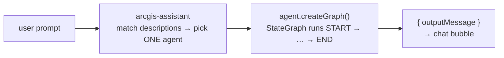

# Adding a Custom Agent to the ArcGIS AI Assistant

A step-by-step guide to building and registering a new custom agent on the
`<arcgis-assistant>` web component, following the patterns already used by the
six custom agents in [`src/agents/`](../src/agents/).

For a top-down view of the whole AI subsystem, see
[ARCHITECTURE.md §6](./ARCHITECTURE.md#6-the-ai-subsystem-assistant-agents-mcp).

---

## 1. How the assistant uses agents

The `<arcgis-assistant>` component is a **multi-agent router**. On every user
message it:

1. Reads the `description` of every registered agent (built-in + custom).
2. Picks **exactly one** agent whose description best matches the message.
3. Calls that agent's `createGraph()`, runs the resulting **LangGraph**
   `StateGraph` from `START` to `END`, and renders whatever ends up in the
   graph's `outputMessage` state as the assistant's chat reply.



Two consequences shape everything below:

- **The `description` is the routing contract.** It is the only thing the
  router sees. A vague description means your agent steals messages from other
  agents (or never gets any).
- **One agent per message.** There is no fallthrough; if your agent is picked
  and fails, the user sees your failure message. Always return a friendly
  `outputMessage`, never throw.

---

## 2. Anatomy of an agent

A custom agent is a plain object handed to an `<arcgis-assistant-agent>`
element:

```ts
const agent = {
  id: "my-custom-agent",        // unique, kebab-case
  name: "My Custom Agent",      // display name
  description: "…",             // ROUTING CONTRACT — see §6
  createGraph,                  // () => StateGraph (uncompiled)
  workspace: {},                // reserved; leave empty
};
```

`createGraph` is called fresh for each message, so the graph itself is
stateless. Anything that must survive between messages goes in a module-level
session store or the shared assistant state (see §7).

---

## 3. Step-by-step: a minimal agent

### 3.1 Create the file

Create `src/agents/MyCustomAgent.ts`. The full skeleton:

```ts
import { StateGraph, Annotation as ANNOTATION, START, END } from "@langchain/langgraph/web";
import { extractLastUserText } from "../utils/agentHelpers";

export function registerMyCustomAgent(assistant: HTMLElement) {
  const agentId = "my-custom-agent";

  const createGraph = () => {
    // ── State shape ──────────────────────────────────────────────
    const state = ANNOTATION.Root({
      // Conversation messages fed in by the assistant.
      messages: ANNOTATION({
        reducer: (cur: any[] = [], update: any) => [...cur, update],
        default: () => [],
      }),
      // Whatever a node writes here becomes the chat reply.
      outputMessage: ANNOTATION({
        reducer: (current: string = "", update: any) =>
          typeof update === "string" && update.trim()
            ? current ? `${current}\n\n${update}` : update
            : current,
        default: () => "",
      }),
    });

    // ── Node ─────────────────────────────────────────────────────
    async function myNode(s: any) {
      const text = extractLastUserText(s);
      try {
        // ... do the actual work in TypeScript ...
        return { outputMessage: `Done! You asked: "${text}"` };
      } catch (err: any) {
        return { outputMessage: `Sorry, that failed: ${err?.message ?? String(err)}` };
      }
    }

    // ── Graph wiring ─────────────────────────────────────────────
    return new StateGraph(state)
      .addNode("myNode", myNode)
      .addEdge(START, "myNode")
      .addEdge("myNode", END);
  };

  // ── Agent definition ───────────────────────────────────────────
  const agent = {
    id: agentId,
    name: "My Custom Agent",
    description:
      "Does X when the user asks for Y. Use when the user says 'do X', 'run X on Z'. " +
      "Do not use for layer management, STAC imagery, or general questions.",
    createGraph,
    workspace: {},
  } as any;

  // ── Idempotent DOM registration ────────────────────────────────
  const existing = assistant.querySelector(`[data-agent-id="${agentId}"]`);
  if (existing) existing.remove();

  const agentEl = document.createElement("arcgis-assistant-agent") as any;
  agentEl.setAttribute("data-agent-id", agentId);
  agentEl.agent = agent;
  assistant.appendChild(agentEl);
}
```

Notes on the pieces:

| Piece | Why it looks like this |
| --- | --- |
| `@langchain/langgraph/web` import | The browser build of LangGraph — do not import the Node entry point. |
| `messages` annotation | The assistant injects the conversation here. Read it with [`extractLastUserText`](../src/utils/agentHelpers.ts) — it handles all the message-shape variants (`content`, `kwargs.content`, `lc_kwargs.content`, nested arrays). |
| `outputMessage` reducer | Concatenates with blank lines, so multiple nodes (or multiple partial updates) stack into one reply. Markdown is supported in the chat bubble. |
| Return uncompiled `StateGraph` | The assistant compiles and runs it; do **not** call `.compile()` yourself. |
| remove-then-append guard | The registration effect re-runs (map change, MCP hub refresh), so registration must be idempotent. The `data-agent-id` attribute is the dedupe key. |

### 3.2 Register it in `useAssistantSetup`

All custom agents are appended once the map is ready, in the registration
effect of [`useAssistantSetup.ts`](../src/hooks/useAssistantSetup.ts#L64-L76):

```ts
import { registerMyCustomAgent } from "../agents/MyCustomAgent";

// inside the useEffect, next to the other register* calls:
registerMyCustomAgent(assistant);
```

That's it for plumbing. The effect already guards on `webMapId`, `isMapReady`,
and the presence of the `arcgis-assistant` element. If your agent needs config
(OAuth client id, portal URL, a base URL…), pass it as a second options
argument the way `registerCreateFeatureLayerAgent` and
`registerMcpPassthroughAgent` do.

### 3.3 Verify

1. `npm run dev`, sign in, open a map.
2. In the browser console:
   `document.querySelectorAll("arcgis-assistant-agent").length` — your agent
   element should be present, and
   `document.querySelector('[data-agent-id="my-custom-agent"]').agent` should
   show your object.
3. Ask "what can you do?" — the
   [`AllCapabilitiesAgent`](../src/agents/AllCapabilitiesAgent.ts) walks the
   registered agent elements, so your new agent should appear in its answer
   automatically.
4. Send a message that matches your description and one that should route
   elsewhere; confirm both route correctly.

---

## 4. Extracting parameters from natural language

Most agents need structured parameters (a layer name, a date range, a place)
out of free text. The house pattern — used by every LLM-calling agent in this
repo — is **one `invokeToolPrompt` call with a single Zod-typed extraction
tool**, then doing the real work in plain TypeScript:

```ts
import { invokeToolPrompt } from "@arcgis/ai-orchestrator";
import { HumanMessage } from "@langchain/core/messages";
import { tool } from "@langchain/core/tools";
import { z } from "zod";

const extractTool = tool(
  async (args) => JSON.stringify(args),   // body is irrelevant; we only want args
  {
    name: "extract_my_intent",
    description: "Extract all parameters for X from the user message.",
    schema: z.object({
      target: z.string().nullable().describe(
        "What to operate on. Extract if user says 'do X to <target>' or names a thing."
      ),
      count: z.number().nullable().describe("How many, if the user gives a number."),
    }),
  }
);

async function myNode(s: any) {
  const text = extractLastUserText(s);

  let intent: { target: string | null; count: number | null } =
    { target: null, count: null };

  try {
    const response = await invokeToolPrompt({
      promptText:
        "You extract parameters for X. Always call extract_my_intent " +
        "with everything you find.",
      messages: [new HumanMessage(text || "do X")],
      tools: [extractTool],
      temperature: 0,
    });
    const call = (Array.isArray((response as any)?.tool_calls) ? (response as any).tool_calls : [])
      .find((tc: any) => tc?.name === "extract_my_intent");
    if (call?.args) intent = { ...intent, ...call.args };
  } catch {
    // LLM unavailable → continue with the empty intent (or a regex fallback)
  }

  // ... validate intent, do the work, return { outputMessage } ...
}
```

Conventions that matter:

- **`temperature: 0`** — extraction must be deterministic.
- **`.nullable()` on every field** plus a rich `.describe()` telling the model
  *when* to extract it. The describes are effectively your few-shot examples.
- **Wrap in try/catch and degrade gracefully.** Every agent here survives the
  LLM call failing — fall back to an empty intent, a regex, or a clarification
  question ("Please provide a layer title, item ID, or service URL.").
- **The model is behind `@arcgis/ai-orchestrator`.** There is no direct
  Anthropic/OpenAI call anywhere in this repo; `invokeToolPrompt` is the only
  LLM primitive available to agents.

Reference implementations:
[`AddLayerToMapAgent.ts`](../src/agents/AddLayerToMapAgent.ts) (simplest),
[`ManageFeatureLayerAgent.ts`](../src/agents/ManageFeatureLayerAgent.ts)
(multi-action intent), [`StacSearchAgent.ts`](../src/agents/StacSearchAgent.ts)
(multiple tools branched by triage).

---

## 5. Multi-node graphs

A single node is enough for most agents, but the graph can be any LangGraph
shape:

- **Sequential** — [`CreateFeatureLayerAgent.ts`](../src/agents/CreateFeatureLayerAgent.ts)
  uses `parseRequestNode → createLayerNode`, with the parse step able to short-
  circuit to `END` (hand-off case).
- **Agent/tools loop (ReAct)** —
  [`McpPassthroughAgent.ts`](../src/agents/McpPassthroughAgent.ts) cycles
  `agent → tools → agent` on `tool_calls` until the model stops calling tools,
  then a `respond` node writes the final text. Use `addConditionalEdges` for
  the loop decision.

Whatever the shape, the contract with the assistant is unchanged: the run ends
at `END` with `outputMessage` populated.

---

## 6. Writing the `description` (routing)

This is the highest-leverage part of the whole agent. Treat it as a router
prompt:

1. **Say what the agent does**, in the vocabulary users will actually type.
2. **Say when to use it** ("Use only when the user wants to …").
3. **Say when NOT to use it**, naming the overlapping agents' domains
   explicitly.

Real example from this repo
([`AddLayerToMapAgent.ts`](../src/agents/AddLayerToMapAgent.ts#L156-L157)):

> "Adds a hosted feature layer to the current map. Accepts a layer title/name
> (searches ArcGIS Online), an ArcGIS Online item ID, or a direct FeatureServer
> URL. **Use only when** the user wants to load or add a FeatureServer layer
> into the map. **Do not use for** STAC, asset catalog, collection, or
> item-listing requests."

The negative clause exists because the STAC agent also handles "add … to the
map" phrasing. **When you add a new agent, check every existing description for
overlap with yours and add exclusions on both sides.** Test routing with
ambiguous prompts before considering the agent done.

Also remember the built-in agents (`help`, `navigation`, `data-exploration`,
declared in [`AssistantPanel.tsx`](../src/components/AssistantPanel.tsx)) are
in the same routing pool.

---

## 7. State, memory, and the map

### 7.1 Per-session memory (one agent, across messages)

`createGraph()` runs per message, so module-level state is the way to remember
things between turns. The STAC agent keeps
`sessionStore.lastResults` ([`StacSearchAgent.ts`](../src/agents/StacSearchAgent.ts#L48-L57))
so follow-ups like "apply NDVI to result 3" resolve. It's a plain module
constant — fine for a single-user browser session.

### 7.2 Cross-agent shared memory

[`assistantState.ts`](../src/utils/assistantState.ts) stores snapshots on
`globalThis.__arcgisAssistantState__` so agents can hand data to each other:

| Snapshot | Set by | Read by |
| --- | --- | --- |
| `lastGeoSnapshot` | MCP agent | Create / Manage Feature Layer ("…from memory") |
| `lastCreatedFeatureLayer` | Create Feature Layer | Manage Feature Layer (default target) |

If your agent produces something another agent should be able to consume, add
a setter/getter pair there rather than inventing a new global.

### 7.3 Touching the map

Agents reach the map view through the DOM, not through React props:

```ts
const view = (document.querySelector("#main-map") as any)?.view;
```

From there you can read the extent (the STAC agent converts it to a WGS84
bbox), add/remove layers, or read the popup selection
(`view.popup.selectedFeature.attributes…`). Helpers already exist for common
operations — check [`featureLayerEdits.ts`](../src/utils/featureLayerEdits.ts)
(apply edits, add feature layer to map),
[`stacRenderer.ts`](../src/utils/stacRenderer.ts) (graphics + tile layers), and
[`mcpGeoRenderer.ts`](../src/utils/mcpGeoRenderer.ts) before writing new map
code.

### 7.4 ArcGIS Online calls

Use `getCredential()` from [`arcgisOnline.ts`](../src/utils/arcgisOnline.ts)
for tokens, and prefer its existing helpers (portal search, item lookup,
service creation) over raw fetches.

---

## 8. Error handling rules

- **Never throw out of a node.** Catch everything and return
  `{ outputMessage: "human-readable explanation" }` — that's the only way the
  user learns what went wrong.
- **Validate before acting**; if required parameters are missing after
  extraction, ask for them ("Please provide a layer title, item ID, or service
  URL.") instead of guessing.
- **Be specific in failures.** See `explainUnresolvedScene` in
  [`StacSearchAgent.ts`](../src/agents/StacSearchAgent.ts#L92-L118) for the
  standard: distinguish "no results in memory" from "number out of range"
  rather than emitting a generic error.
- Long-running agents should honor cancellation: the MCP agent uses an
  `AbortController` plus a run token to abandon stale runs on `arcgisCancel`
  ([`McpPassthroughAgent.ts`](../src/agents/McpPassthroughAgent.ts)). Adopt
  that pattern if your agent makes slow network calls.

---

## 9. Checklist

- [ ] File created in `src/agents/`, exporting a single `register<Name>Agent(assistant, options?)` function.
- [ ] Graph state has `messages` + `outputMessage` annotations with the standard reducers.
- [ ] Returns the **uncompiled** `StateGraph`; ends at `END` with `outputMessage` set on every path (success *and* failure).
- [ ] Unique kebab-case `id`; idempotent remove-then-append registration keyed on `data-agent-id`.
- [ ] `description` states use-cases **and** exclusions; existing agent descriptions updated if domains overlap.
- [ ] LLM use (if any) goes through `invokeToolPrompt` with a Zod-typed `tool()`, `temperature: 0`, and a non-LLM fallback.
- [ ] Register call added to the effect in [`useAssistantSetup.ts`](../src/hooks/useAssistantSetup.ts#L64-L76).
- [ ] Verified: appears in "what can you do?", routes on target prompts, does **not** route on neighboring agents' prompts.
- [ ] Added to the agent tables in [ARCHITECTURE.md](./ARCHITECTURE.md) (§6.1 registry and §7 workflows).

---

## 10. Reference: existing agents by pattern

| Agent | Graph shape | LLM use | Good template for |
| --- | --- | --- | --- |
| [`AllCapabilitiesAgent`](../src/agents/AllCapabilitiesAgent.ts) | 1 node | none | Pure-TypeScript agents, introspection |
| [`AddLayerToMapAgent`](../src/agents/AddLayerToMapAgent.ts) | 1 node | extraction | The canonical simple agent |
| [`ManageFeatureLayerAgent`](../src/agents/ManageFeatureLayerAgent.ts) | 1 node | extraction (multi-action) | Action verbs + target resolution |
| [`StacSearchAgent`](../src/agents/StacSearchAgent.ts) | 1 node, internal triage | extraction (several tools) | Session memory, map rendering, external APIs |
| [`CreateFeatureLayerAgent`](../src/agents/CreateFeatureLayerAgent.ts) | 2 nodes | extraction | Parse → act pipelines, agent hand-off |
| [`McpPassthroughAgent`](../src/agents/McpPassthroughAgent.ts) | agent⇄tools loop | full tool-calling | ReAct loops, dynamic tools, cancellation |
