# Full Architecture Report

A complete technical overview of the ArcGIS JavaScript AI Component app: the React
shell, authentication, web-map lifecycle, theming, and the AI assistant /
multi-agent / MCP subsystem.

---

## 1. What this app is

A single-page React + TypeScript app (Vite) that wraps an ArcGIS web map with an
AI **assistant** panel. The assistant is a multi-agent router: built-in Esri agents
(help / navigation / data-exploration) plus six custom agents that search imagery,
manage feature layers, and reach external data through MCP. The model is provided by
`@arcgis/ai-orchestrator`; custom agents are LangGraph state graphs.

### Top-level layout

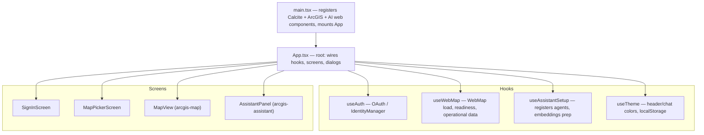

Entry point: [`main.tsx`](../src/main.tsx) imports every Calcite / ArcGIS map /
AI web component, then renders [`App.tsx`](../src/App.tsx).

---

## 2. Application shell & flow

[`App.tsx`](../src/App.tsx) is the orchestrator. It reads env config
(`VITE_ARCGIS_PORTAL_URL`, `VITE_ARCGIS_OAUTH_APP_ID`, MCP base URL), runs the four
hooks, and switches between three screens based on auth + map state:

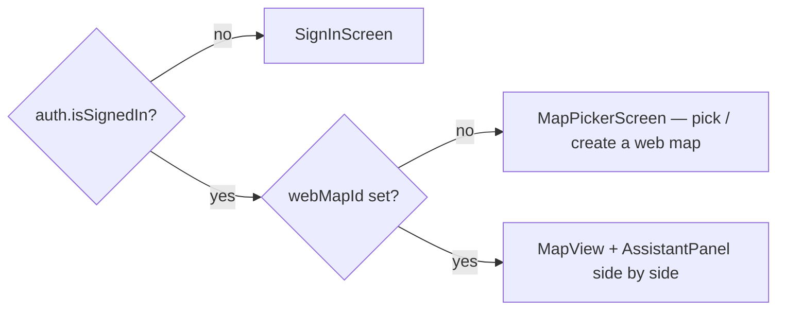

Dialogs (sign-out, theme editor, change-map, new-map, MCP Hub manager) are transient
state in `App`. A hidden easter egg — Ctrl/Cmd+Shift+click on the MCP button — toggles
the embeddings "regenerate" button ([`App.tsx`](../src/App.tsx#L125-L144)).

---

## 3. Authentication

[`useAuth.ts`](../src/hooks/useAuth.ts) wraps the ArcGIS `IdentityManager` OAuth flow.

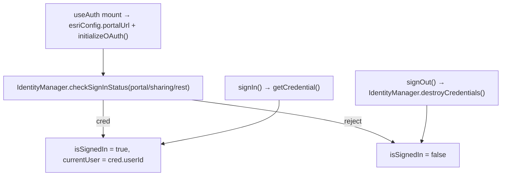

Credentials/tokens are obtained via `getCredential()` in
[`arcgisOnline.ts`](../src/utils/arcgisOnline.ts) and reused by every hook/agent that
talks to ArcGIS Online.

---

## 4. Web-map lifecycle

[`useWebMap.ts`](../src/hooks/useWebMap.ts) owns the `arcgis-map` element and tracks
readiness.

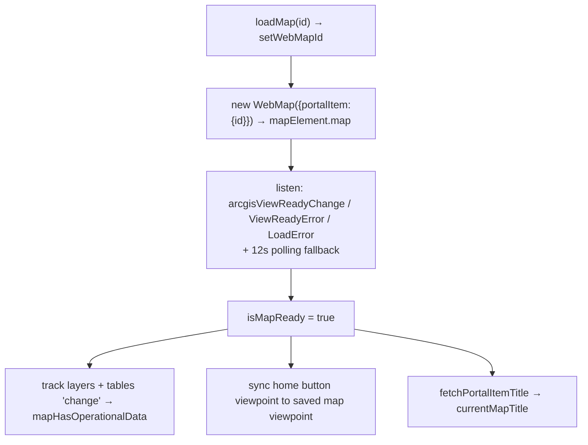

Key behaviors:

- **Last map persisted** to `localStorage` (`arcgis-assistant:last-webmap`) and
  restored on sign-in ([`useWebMap.ts`](../src/hooks/useWebMap.ts#L80-L95)).
- **Non-fatal layer errors:** once the view is ready, a load error from an operational
  layer (e.g. a STAC tile layer) does *not* tear down the map
  ([`useWebMap.ts`](../src/hooks/useWebMap.ts#L121-L133)).
- `mapHasOperationalData` gates the map-aware assistant tools and the empty-map notice.

---

## 5. Theming

[`useTheme.ts`](../src/hooks/useTheme.ts) holds header + chat-panel colors/fonts,
persisted to `localStorage` (`arcgis-demo-theme`). `ThemeEditorDialog` edits a live
snapshot; Cancel restores the pre-edit snapshot, Done saves. Theme values flow as
props into `AppHeader` and `AssistantPanel` (which maps them to CSS custom properties
on `<arcgis-assistant>`).

---

## 6. The AI subsystem (assistant, agents, MCP)

This is the core. The app uses Esri's `<arcgis-assistant>` web component as a
**multi-agent router**: it reads each agent's `description` and routes each user
message to exactly one agent, then runs that agent's **LangGraph** to completion.

> To build a new custom agent, follow the step-by-step guide in
> [ADDING_CUSTOM_AGENTS.md](./ADDING_CUSTOM_AGENTS.md).

### 6.1 Agent registry

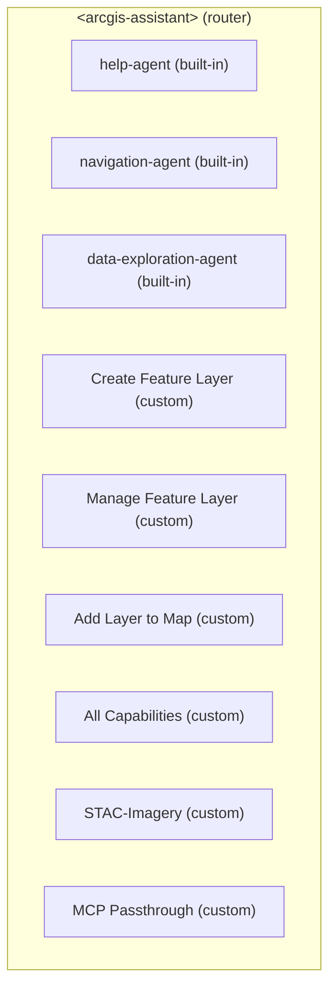

- Built-in agents declared as child elements in
  [`AssistantPanel.tsx`](../src/components/AssistantPanel.tsx#L130-L133).
- Custom agents appended at runtime once the map is ready by
  [`useAssistantSetup.ts`](../src/hooks/useAssistantSetup.ts#L64-L76).
- Each custom agent is an `<arcgis-assistant-agent>` element carrying
  `agent = { id, name, description, createGraph }`. **The `description` is the routing
  contract** the orchestrator matches against.

### 6.2 Per-message routing & the shared LLM primitive

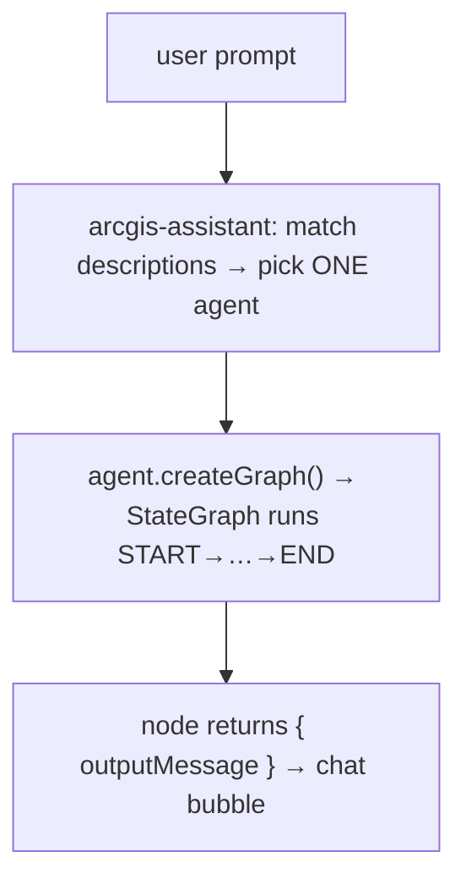

Inside nodes, agents call **`invokeToolPrompt`** (from `@arcgis/ai-orchestrator`) with
a system prompt + messages + Zod-typed LangChain `tool()`s, at `temperature: 0`. It
returns `tool_calls` — the agents use the LLM purely for **structured extraction** of
parameters from natural language, then do the real work in TypeScript. Every agent has
a regex/empty-intent fallback if the LLM call fails.

> **There is no direct Anthropic/OpenAI call in this repo** — the model lives behind
> `@arcgis/ai-orchestrator`.

### 6.3 Cross-agent shared memory

[`assistantState.ts`](../src/utils/assistantState.ts) stores two snapshots on
`globalThis.__arcgisAssistantState__`, letting agents hand off to each other:

| Snapshot | Set by | Read by |
| --- | --- | --- |
| `lastGeoSnapshot` (geocoded entities) | MCP agent (`setLastAssistantGeoSnapshot`) | Create / Manage Feature Layer ("...from memory") |
| `lastCreatedFeatureLayer` | Create Feature Layer | Manage Feature Layer (default target) |

The STAC agent keeps its own module-level `sessionStore.lastResults` for follow-ups
like "apply NDVI to result 3".

---

## 7. Agent-by-agent workflows

### 7.1 STAC-Imagery — [`StacSearchAgent.ts`](../src/agents/StacSearchAgent.ts)

Single-node graph that branches by intent: list collections, clear, list/apply raster
functions, load a specific found scene, or run a fresh search.

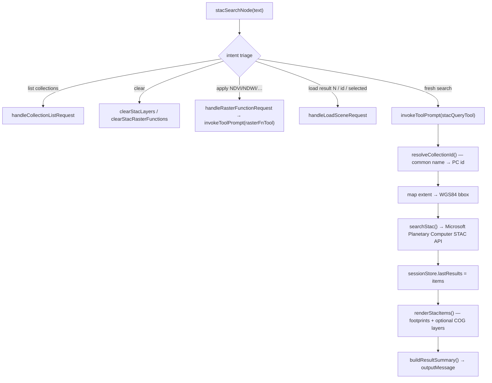

- Scene selection is read from the map's native popup
  (`view.popup.selectedFeature.attributes.stac_item_id`) — no custom click handler.
- Supporting utils: [`stacApi.ts`](../src/utils/stacApi.ts),
  [`stacRenderer.ts`](../src/utils/stacRenderer.ts),
  [`stacRasterFunctions.ts`](../src/utils/stacRasterFunctions.ts).

### 7.2 MCP Passthrough — [`McpPassthroughAgent.ts`](../src/agents/McpPassthroughAgent.ts)

A real ReAct-style agent/tools loop over JSON-RPC MCP tools, plus an async geo
side-channel that plots the answer on the map.

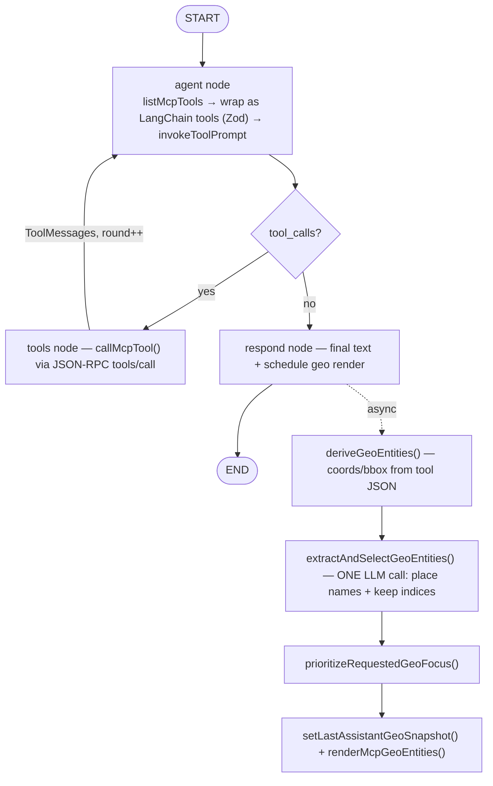

Transport details:

- JSON-RPC 2.0 over HTTP POST; handles both JSON and SSE (`text/event-stream`)
  responses. Handshake: `initialize` → `notifications/initialized` → `tools/list` →
  `tools/call`. Tools cached 5 min.
- **CORS bypass (dev):** absolute MCP URLs are rewritten to
  `/dev-mcp-relay/<scheme>/<host>/<path>`, proxied server-side by Vite's dynamic
  `router` ([`vite.config.ts`](../vite.config.ts#L31-L49)).
- **Hub support:** an MCP hub can front multiple servers; tools are namespaced
  `serverId__toolName`. Managed via the `HubServerManager` dialog; `refreshMcpHub`
  re-mounts the agent.
- **Cancellation:** `AbortController` set + `latestMcpRunToken` abandon stale runs on
  `arcgisCancel`.
- The plain REST client in [`arcgisMcp.ts`](../src/utils/arcgisMcp.ts) (layer/content
  search, feature tables, field summaries) is a separate, non-agent path used by UI.

### 7.3 Create Feature Layer — [`CreateFeatureLayerAgent.ts`](../src/agents/CreateFeatureLayerAgent.ts)

Two-node graph. `parseRequestNode` extracts name/geometry/fields and whether to seed
from memory; if the request is actually "add to existing," it hands off to the Manage
agent. `createLayerNode` creates a hosted Feature Service, optionally seeds it from the
`lastGeoSnapshot`, adds it to the map, and records `lastCreatedFeatureLayer`.

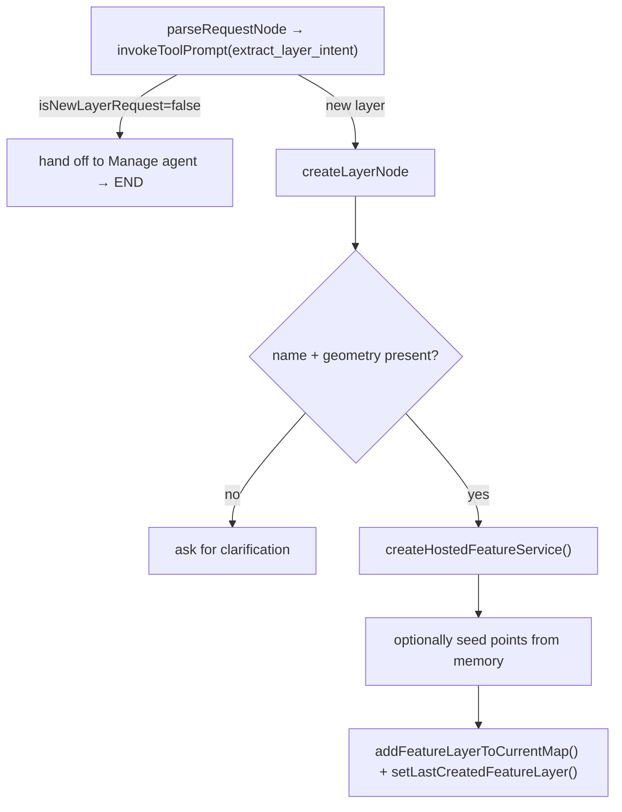

### 7.4 Manage Feature Layer — [`ManageFeatureLayerAgent.ts`](../src/agents/ManageFeatureLayerAgent.ts)

Single node. Extracts an edit intent (`add` / `update` / `delete` / `sync`), resolves
the target layer (explicit URL → map layer by name → portal search → last created), and
applies the edit. For adds it can **geocode a place name** (ArcGIS World Geocoder),
choosing point vs. polygon based on the layer's geometry type. `sync`/memory paths
upsert from `lastGeoSnapshot`.

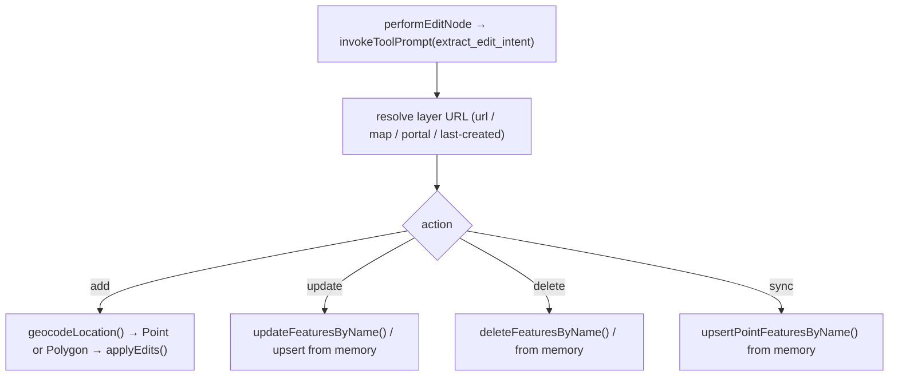

Edit primitives live in [`featureLayerEdits.ts`](../src/utils/featureLayerEdits.ts).

### 7.5 Add Layer to Map — [`AddLayerToMapAgent.ts`](../src/agents/AddLayerToMapAgent.ts)

Single node. Extracts a title / item ID / service URL, resolves it to a FeatureServer
URL (direct URL → item lookup → portal title search), and adds it to the current map.
Explicitly declines STAC/catalog/collection requests so routing stays clean.

### 7.6 All Capabilities — [`AllCapabilitiesAgent.ts`](../src/agents/AllCapabilitiesAgent.ts)

No LLM call. Walks the assistant's child agent elements and returns a formatted list of
built-in + custom capabilities. Answers "what can you do?".

---

## 8. The "embeddings" preparation (map-aware tools)

Separate from custom agents: when a web map with operational data loads,
[`useAssistantSetup.ts`](../src/hooks/useAssistantSetup.ts#L78-L141) checks for / generates
**web-map embeddings** in ArcGIS Online (via `arcgisOnline.ts`). These power the
built-in `navigation` and `data-exploration` agents so they can reason about the map's
layers. The "Preparing assistant…" notice in `AssistantPanel` tracks this. Custom
agents (STAC, MCP, feature-layer) work regardless of embedding status.

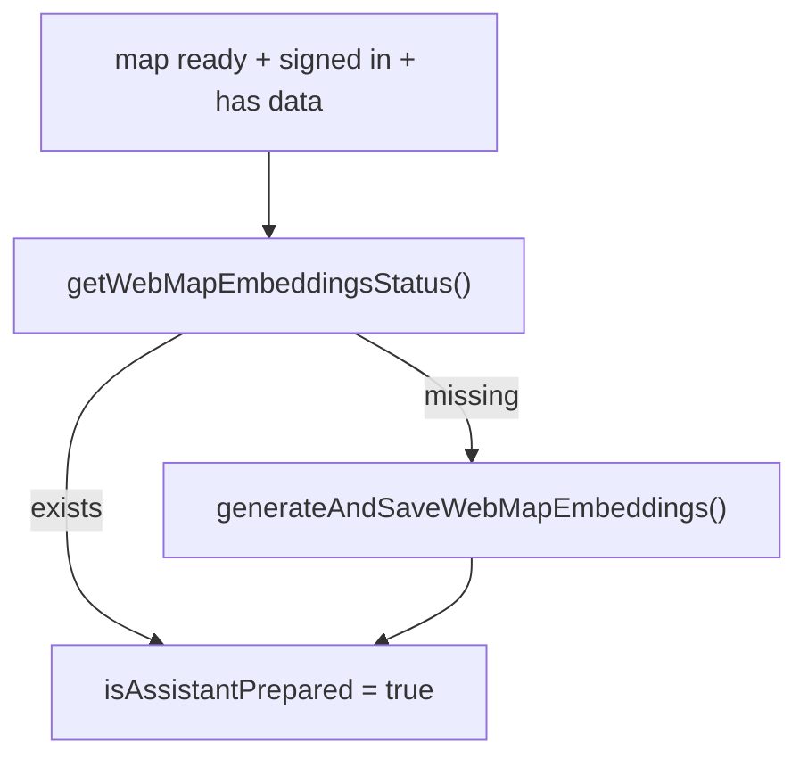

---

## 9. Configuration & environment

| Variable | Purpose | Default |
| --- | --- | --- |
| `VITE_APP_NAME` | App / header title | "ArcGIS Agent Components Demo" |
| `VITE_ARCGIS_PORTAL_URL` | Portal endpoint | `https://www.arcgis.com` |
| `VITE_ARCGIS_OAUTH_APP_ID` | OAuth client id | — |
| `VITE_MCP_BASE_URL` / `VITE_ARCGIS_MCP_BASE_URL` | MCP REST base | `/api/mcp` |
| `VITE_MCP_PROXY_TARGET` / `VITE_ARCGIS_MCP_PROXY_TARGET` | Dev proxy target | `http://127.0.0.1:8808` |

Dev server: Vite on port **5300**, with the `/dev-mcp-relay`, `/api/mcp`, and
`/api/arcgis-mcp` proxies ([`vite.config.ts`](../vite.config.ts)).

---

## 10. Full file map

| Area | Files |
| --- | --- |
| **Entry / shell** | [`main.tsx`](../src/main.tsx), [`App.tsx`](../src/App.tsx) |
| **Hooks** | [`useAuth.ts`](../src/hooks/useAuth.ts), [`useWebMap.ts`](../src/hooks/useWebMap.ts), [`useAssistantSetup.ts`](../src/hooks/useAssistantSetup.ts), [`useTheme.ts`](../src/hooks/useTheme.ts) |
| **Screens / UI** | [`SignInScreen`](../src/components/SignInScreen.tsx), [`MapPickerScreen`](../src/components/MapPickerScreen.tsx), [`MapView`](../src/components/MapView.tsx), [`AssistantPanel`](../src/components/AssistantPanel.tsx), [`AppHeader`](../src/components/AppHeader.tsx), [`AccountMenu`](../src/components/AccountMenu.tsx) |
| **Dialogs** | [`SignOutDialog`](../src/components/SignOutDialog.tsx), [`ThemeEditorDialog`](../src/components/ThemeEditorDialog.tsx), [`ChangeMapDialog`](../src/components/ChangeMapDialog.tsx), [`NewMapDialog`](../src/components/NewMapDialog.tsx), [`HubServerManager`](../src/components/HubServerManager.tsx) |
| **Agents** | [`StacSearchAgent`](../src/agents/StacSearchAgent.ts), [`McpPassthroughAgent`](../src/agents/McpPassthroughAgent.ts), [`mcpAgentCore`](../src/agents/mcpAgentCore.ts), [`CreateFeatureLayerAgent`](../src/agents/CreateFeatureLayerAgent.ts), [`ManageFeatureLayerAgent`](../src/agents/ManageFeatureLayerAgent.ts), [`AddLayerToMapAgent`](../src/agents/AddLayerToMapAgent.ts), [`AllCapabilitiesAgent`](../src/agents/AllCapabilitiesAgent.ts) |
| **AI utils** | [`agentHelpers`](../src/utils/agentHelpers.ts), [`assistantState`](../src/utils/assistantState.ts), [`assistantStyler`](../src/utils/assistantStyler.ts), [`assistantSuggestions`](../src/utils/assistantSuggestions.ts), [`mcpZodSchema`](../src/utils/mcpZodSchema.ts), [`mcpGeoRenderer`](../src/utils/mcpGeoRenderer.ts) |
| **STAC utils** | [`stacApi`](../src/utils/stacApi.ts), [`stacRenderer`](../src/utils/stacRenderer.ts), [`stacRasterFunctions`](../src/utils/stacRasterFunctions.ts) |
| **ArcGIS / MCP utils** | [`arcgisOnline`](../src/utils/arcgisOnline.ts), [`arcgisMcp`](../src/utils/arcgisMcp.ts), [`featureLayerEdits`](../src/utils/featureLayerEdits.ts) |
| **Build / config** | [`vite.config.ts`](../vite.config.ts) |
